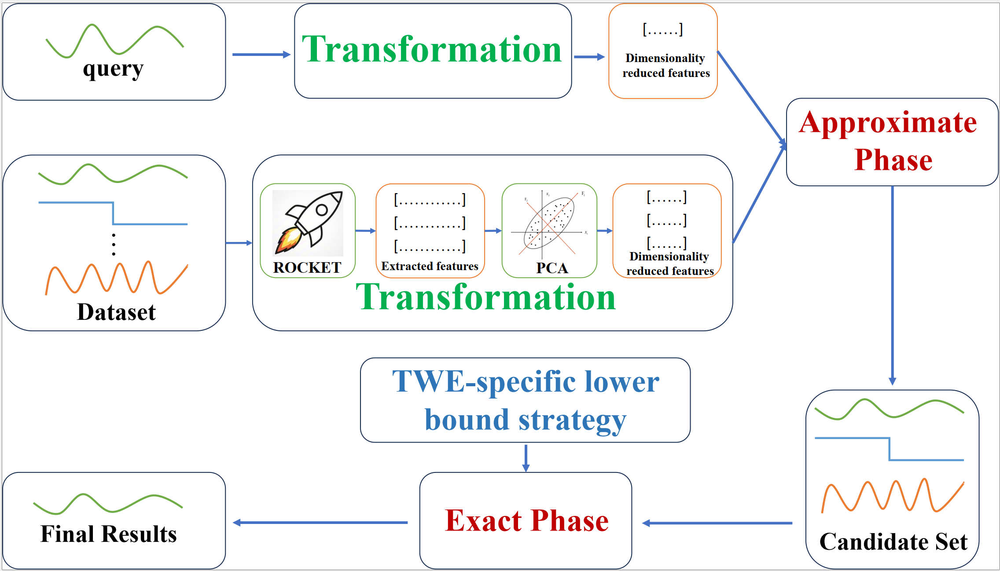

# FastTWE: Making TWE-based Time-Series Similarity Search Faster via Random Convolutional Kernels
This repository is the official implementation of [ FastTWE: Making TWE-based Time-Series Similarity Search Faster via Random Convolutional Kernels]

## The overall execution process of applying the FastTWE algorithm to time series similarity search.

 

## Usage
download and read the UCR dataset(https://www.cs.ucr.edu/~eamonn/time_series_data_2018/).

Our code is easy to run; simply execute main_efficiency.py and main_accuracy to generate results.

The lower bound GLB is used in FastTWE. Please refer to [Accelerating Similarity Search for Elastic Measures: A Study and New Generalization of Lower Bounding Distances]

To evaluate the retrieval accuracy of the proposed FastTWE method, run 'main_efficiency.py'

To evaluate the running time of the proposed FastTWE method, run 'main_efficiency.py'

The Parameter Sensitivity Analysis can be verified by changing the parameters used in 'accuracy.py' and 'efficiency.py'.

**Requirements**: NumPy, scipy, matplotlib, aeon, sklearn, numba, pandas, pymetis, random, sktime

## Acknowledgments

We express our gratitude to Dr.Eamonn Keogh and his colleagues for providing the UCR datasets [1] used in this article.

We extend our gratitude to the authors of R-Clustering[2] and MiniROCKET[3] for providing their code!

Thanks to the authors of aeon[4] and sktime[5] for providing such excellent libraries!

[1] Hoang Anh Dau, Eamonn Keogh, Kaveh Kamgar, Chin-Chia Michael Yeh, Yan Zhu, Shaghayegh Gharghabi , Chotirat Ann Ratanamahatana, Yanping Chen, Bing Hu, Nurjahan Begum, Anthony Bagnall , Abdullah Mueen, Gustavo Batista, & Hexagon-ML (2019). The UCR Time Series Classification Archive. URL https://www.cs.ucr.edu/~eamonn/time_series_data_2018/

[2] Jorge M B, Rubén C. Time series clustering with random convolutional kernels[J]. Data Mining and Knowledge Discovery, 2024, 38(4): 1862-1888.

[3] Dempster A, Schmidt D F, Webb G I. Minirocket: A very fast (almost) deterministic transform for time series classification[C]//Proceedings of the 27th ACM SIGKDD conference on knowledge discovery & data mining. 2021: 248-257.

[4] Middlehurst M, Ismail-Fawaz A, Guillaume A, et al. aeon: a Python toolkit for learning from time series[J]. Journal of Machine Learning Research, 2024, 25(289): 1-10.

[5] Löning M, Bagnall A, Ganesh S, et al. sktime: A unified interface for machine learning with time series[J]. arXiv preprint arXiv:1909.07872, 2019

